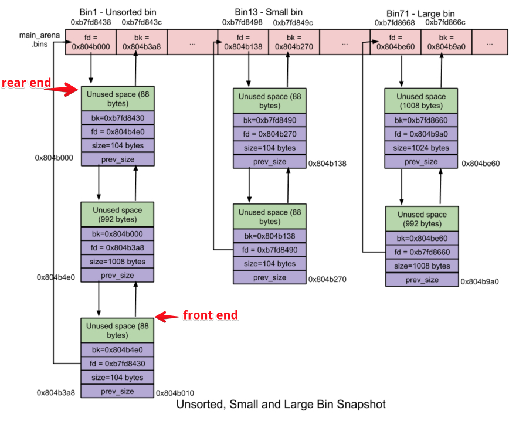

# Linux堆溢出基础


堆的生长方向是从低地址向高地址生长的，而栈是从高地址向低地址生长的。

实际上堆可以申请到的内存空间比栈要大很多，在 linux 的 4G 的虚拟内存空间里最高可以达到 2.9 G 的空间

下面我们以libc 库下的 ptmalloc2 堆管理器来分析堆的基本机构

## 堆的基本结构


```
1、pre size 字段。只有在前面一个堆块是空闲的时候才有指，用来指示前一个堆块的大小。前面一个堆块在使用时，他的值始终为 0
2、size 字段。是用来指示当前堆块的大小的（头部加上 user data 的大小）。但是这个字段的最后三位相当于三个 flag ，有另外的作用。堆内存中要求每个chunk的大小必须为8的整数倍，因此chunk size的后3位是无效的，为了充分利用内存，堆管理器将这3个比特位用作chunk的标志位，典型的就是将第0比特位用于标记该chunk是否已经被分配。
	最后三位的含义
	NON_MAIN_ARENA     这个堆块是否位于主线程
	IS_MAPPED          记录当前 chunk 是否是由 mmap 分配的
	PREV_INUSE         记录前一个 chunk 块是否被分配，被分配值为1，同时size字段会比原来的值大1个字节
3、user data 用来存放用户数据的。
举例：
	在64位系统中使用malloc(8)size大小为16 + 8 + 8 + 1 = 0x21
	1> 16字节是系统最小分配的内存，也就是说你如果想要申请的内存小于系统最小分配的内存的话，就会按照最小的内存来分配。
	2> 8字节是 presize 字段的大小(32位为4字节) 
	3> 8字节为 size 字段的大小(32为的为4字节)
	4> 1字节是PREV_INUSE的值，只有0或1两个值
```

### 指针与地址

我们调用malloc函数时返回的值为一个指针，指向分配到堆空间（用户数据区）


```
first chunk（second chunk）表示第一和第二个结构，每个结构中都有一个 point_heap 指针来指向存储用户数据的堆块（chunk）。
左边的这个本身就是一个堆块，用来存放一些全局信息。比如 max_size 存储了能够存储的最大结构数量；exist_num 表示已经存储的结构的数量。
```

### IDA 中常见的指针表示形式

在 IDA 伪代码中的指针形式形如下面的情况：

```c
*(qword_6020A8 + 8)
```

**表示取到 qword_6020A8 这个地址加 8 偏移的那个地址存储的值**

汇编代码等同于：

```assembly
.text:0000000000400F85                 mov     rax, cs:qword_6020A8
.text:0000000000400F8C                 mov     rax, [rax+8]
```

简单转化一下，也就是：

```c
*(addr) = [addr]
```

### 申请堆块的本质

堆管理器 ptmalloc2 主要是通过 malloc/free 函数来分配和释放内存块。

ptmalloc2 的作用通俗的讲就是相当于一个”中间商”，在程序想要申请向系统申请堆空间时，这里的 ptmalloc2 就会申请一块很大的空间，并根据算法从这些内存中把空间真正的分配给程序。


使用代码动调看看

```c
#include <stdio.h>
#include <malloc.h>
int main(){
	char *p;
	p = malloc(10);
	return 0;
}
//gcc egtest.c -o egtest
```

使用gdb进行调试 gdb ./egtest，在main函数处下个断点，使用n单步调到call malloc处


单步执行n后，使用vmmap命令再次查看内存，发现出现了堆段


我们只申请了10字节，但是系统却给分配了

```python
 hex(0x000055555557a000 - 0x0000555555559000)
'0x21000'
 0x21000/1024 = 132 KB
这132KB的堆空间叫做arena，此时因为是主线程分配的，所以这个区域叫做 main arena
也就是说这 132 KB 是”厂家”（内核）批发给”中间商”（ptmalloc2）的货物，以便下次程序在向系统申请小内存的时候，直接去”中间商”去取就行了，他就会在这 132KB 中按照要申请”货物”的多少进行分配下去。若”中间商”缺货了话，ptmalloc2 就继续去找”厂家”（系统内核）去取货。同时这块区域拥有可读可写不可执行的权限
```

#### 查看已分配的堆内存分布

此时我们已经执行完了malloc函数，申请到的堆指针是保存在eax中


我们去看看内存堆块的情况：

```sh
64位：
x/32gx 0x5555555592a0 - 0x10
32位：
x/32gx 0x00000000 - 0x10
```


#### main_arena

```
这个 main_arena 其实就是 ptmalloc2 堆管理器通过与操作系统内核进行交互申请到的，也就是相当于上面所说的”批发”到的一堆货物
因为是主线程分配的，所以叫做main arena，通过增加 program break location 的方式来增加 main arena 的大小。
可以用x/32gx &main_arena查看main_arena 的内存分配情况
```


##### Arena介绍

无论有多少个线程，并不是每个线程都有自己独立的arena，arena的个数是跟系统中处理器核心个数相关的

```
For 32 bit systems:
     Number of arena = 2 * number of cores + 1.
For 64 bit systems:
     Number of arena = 8 * number of cores + 1.
```

##### 多Arena的管理

1)首先，glibc malloc循环遍历所有可用的arenas，在遍历的过程中，它会尝试lock该arena。如果成功lock(该arena当前对应的线程并未使用堆内存则表示可lock)，比如将main arena成功lock住，那么就将main arena返回给用户，即表示该arena被线程3共享使用。

2)而如果没能找到可用的arena，那么就将线程3的malloc操作阻塞，直到有可用的arena为止。

3)现在，如果线程3再次调用malloc的话，glibc malloc就会先尝试使用最近访问的arena(此时为main arena)。如果此时main arena可用的话，就直接使用，否则就将线程3阻塞，直到main arena再次可用为止。

这样线程3与主线程就共享main arena了。至于其他更复杂的情况，以此类推。

#### 堆管理介绍

在glibc malloc中针对堆管理，主要涉及到以下3种数据结构：

1、heap_info: 即Heap Header，因为一个**thread arena**（注意：不包含**main thread**）可以包含多个heaps，所以为了便于管理，就给每个heap分配一个heap header。那么在什么情况下一个thread arena会包含多个heaps呢?在当前heap不够用的时候，malloc会通过系统调用mmap申请新的堆空间，新的堆空间会被添加到当前thread arena中，便于管理。

```c
typedef struct _heap_info
{
  mstate ar_ptr; /* Arena for this heap. */
  struct _heap_info *prev; /* Previous heap. */
  size_t size;   /* Current size in bytes. */
  size_t mprotect_size; /* Size in bytes that has been mprotected
                           PROT_READ|PROT_WRITE.  */
  /* Make sure the following data is properly aligned, particularly
     that sizeof (heap_info) + 2 * SIZE_SZ is a multiple of
     MALLOC_ALIGNMENT. */
  char pad[-6 * SIZE_SZ & MALLOC_ALIGN_MASK];
} heap_info;
```

2、malloc_state: 即Arena Header，每个thread只含有一个Arena Header。Arena Header包含bins的信息、top chunk以及最后一个remainder chunk等

```c
struct malloc_state
{
  /* Serialize access.  */
  mutex_t mutex;
  /* Flags (formerly in max_fast).  */
  int flags;
  /* Fastbins */
  mfastbinptr fastbinsY[NFASTBINS];
  /* Base of the topmost chunk -- not otherwise kept in a bin */
  mchunkptr top;
  /* The remainder from the most recent split of a small request */
  mchunkptr last_remainder;
  /* Normal bins packed as described above */
  mchunkptr bins[NBINS * 2 - 2];
  /* Bitmap of bins */
  unsigned int binmap[BINMAPSIZE];
  /* Linked list */
  struct malloc_state *next;
  /* Linked list for free arenas.  */
  struct malloc_state *next_free;
  /* Memory allocated from the system in this arena.  */
  INTERNAL_SIZE_T system_mem;
  INTERNAL_SIZE_T max_system_mem;
};
```

3、malloc_chunk: 即Chunk Header，一个heap被分为多个chunk，至于每个chunk的大小，这是根据用户的请求决定的，也就是说用户调用malloc(size)传递的size参数“就是”chunk的大小。每个chunk都由一个结构体malloc_chunk表示：

```c
struct malloc_chunk {
  /* #define INTERNAL_SIZE_T size_t */
  INTERNAL_SIZE_T      prev_size;  /* Size of previous chunk (if free).  */
  INTERNAL_SIZE_T      size;       /* Size in bytes, including overhead. */
  struct malloc_chunk* fd;         /* double links -- used only if free. 这两个指针只在free chunk中存在*/
  struct malloc_chunk* bk;
  /* Only used for large blocks: pointer to next larger size.  */
  struct malloc_chunk* fd_nextsize; /* double links -- used only if free. */
  struct malloc_chunk* bk_nextsize;
};
```

1.**Main thread**不含有多个heaps所以也就不含有heap_info结构体。当需要更多堆空间的时候，就通过扩展sbrk的heap segment来获取更多的空间，直到它碰到内存mapping区域为止。
2.不同于thread arena，main arena的arena header并不是sbrk heap segment的一部分，而是一个全局变量！因此它属于libc.so的data segment。

#### heap segment与arena关系

首先，通过内存分布图理清malloc_state与heap_info之间的组织关系。

只有一个heap segment的main arena和thread arena的内存分布图


一个thread arena中含有多个heap segments的情况


thread arena只含有一个malloc_state(即arena header)，却有两个heap_info(即heap header)。由于两个heap segments是通过mmap分配的内存，两者在内存布局上并不相邻而是分属于不同的内存区间，所以为了便于管理，libc malloc将第二个heap_info结构体的prev成员指向了第一个heap_info结构体的起始位置（即ar_ptr成员），而第一个heap_info结构体的ar_ptr成员指向了malloc_state，这样就构成了一个单链表，方便后续管理。

#### 对chunk的理解

```
在glibc malloc中将整个堆内存空间分成了连续的、大小不一的chunk，即对于堆内存管理而言chunk就是最小操作单位。Chunk总共分为4类：
1)allocated chunk;
2)free chunk;
3)top chunk;
4)Last remainder chunk。
从本质上来说，所有类型的chunk都是内存中一块连续的区域，只是通过该区域中特定位置的某些标识符加以区分。为了简便，我们先将这4类chunk简化为2类：allocated chunk以及free chunk，前者表示已经分配给用户使用的chunk，后者表示未使用的chunk。
```

##### 隐式链表技术

任何堆内存管理器都是以chunk为单位进行堆内存管理的，而这就需要一些数据结构来标志各个块的边界，以及区分已分配块和空闲块。大多数堆内存管理器都将这些边界信息作为chunk的一部分嵌入到chunk内部

 简单的allocated chunk格式


简单的free chunk格式


```
	堆内存中要求每个chunk的大小必须为8的整数倍，因此chunk size的后3位是无效的，为了充分利用内存，堆管理器将这3个比特位用作chunk的标志位，典型的就是将第0比特位用于标记该chunk是否已经被分配。
	这样的设计很巧妙，因为我们只要获取了一个指向chunk size的指针，就能知道该chunk的大小，即确定了此chunk的边界，且利用chunk size的第0比特位还能知道该chunk是否已经分配，这样就成功地将各个chunk区分开来。注意在allocated chunk中padding部分主要是用于地址对齐的(也可用于对付外部碎片)，即让整个chunk的大小为8的整数倍。
	通过上面的设计，我们就能将整个堆内存组织成一个连续的已分配或未分配chunk序列:
```


```
	上面的这种结构就叫做隐式链表。该链表隐式地由每个chunk的size字段链接起来，在进行分配操作的时候，堆内存管理器可以通过遍历整个堆内存的chunk，分析每个chunk的size字段，进而找到合适的chunk。

	这种隐式链表效率其实是相当低的，特别是在内存回收方面，它难以进行相邻多个free chunk的合并操作。我们知道，如果只对free chunk进行分割，而不进行合并的话，就会产生大量小的、无法继续使用的内部碎片，直至整个内存消耗殆尽。因此堆内存管理器设计了带边界标记的chunk合并技术。
```

###### 带边界标记的合并技术

```
	假设我们要释放的chunk为P，它紧邻的前一个chunk为FD，紧邻的后一个chunk为BK，且BK与FD都为free chunk。将P于BK合并在一起是很容易的，因为可以通过P的size字段轻松定位到BK的开始位置，进而获取BK的size等等，但是将P于FD合并却很难，我们必须从头遍历整个堆，找到FD，然后加以合并，这就意味着每次进行chunk释放操作消耗的时间与堆的大小成线性关系。为了解决这个问题，Knuth提出了一种聪明而通用的技术——边界标记。
	Knuth在每个chunk的最后添加了一个脚部(Footer)，它就是该chunk 头部(header)的一个副本，我们称之为边界标记：
```


```
	显然每个chunk的脚部都在其相邻的下一个chunk的头部的前4个字节处。通过这个脚部，堆内存管理器就可以很容易地得到前一个chunk的起始位置和分配状态，进而加以合并了。	
	但是，边界标记同时带来了一个问题：它要求每个块都包含一个头部和脚部，如果应用程序频繁地进行小内存的申请和释放操作的话(比如1，2个字节)，就会造成很大的性能损耗。同时，考虑到只有在对free chunk进行合并的时候才需要脚部，也就是说对于allocated chunk而言它并不需要脚部，因此我们可以对这个脚部加以优化——将前一个chunk的已分配/空闲标记位存储在当前chunk的size字段的第1，或2比特位上，这样如果我们通过当前chunk的size字段知道了前一个chunk为free chunk，那么就可得出结论：当前chunk地址之前的4个字节为前一个free chunk的脚部，我们可以通过该脚部获取前一个chunk的起始位置；如果当前chunk的size字段的标记位表明前一个chunk是allocated chunk的话，那么就可得出另一个结论：前一个chunk没有脚部，即当前chunk地址之前的4个字节为前一个allocated chunk的payload或padding的最后部分。新的chunk格式图如下：
```


```
随着技术的发展，特别是堆内存管理器添加对多线程的支持，前述的chunk格式已经难以满足需求，比如，我们需要标志位来标记当前chunk是否属于非主线程即thread arena，以及该chunk由mmap得来还是通过brk实现等等。但此时chunk size只剩下一个比特位未使用了，怎么办呢？这需要对chunk格式进行大手术！

首先思考：是否有必要同时保存当前chunk和前一个chunk的已分配/空闲标记位？答案是否定的，因为我们只需要保存前一个chunk的分配标志位就可以了，至于当前chunk的分配标志位，可以通过查询下一个chunk的size字段得到。那么size字段中剩下的两个比特位就可以用于满足多线程的标志需求了：
```


```
再进一步，发现没必要保存chunk size的副本，也就是说Footer的作用并不大，但是如果前一个chunk是free的话，在合并的时候我们又需要知道前一个chunk的大小，怎么办呢？将Footer从尾部移到首部，同时其不再保存当前chunk的size，而是前一个free chunk的size不就行了。同样的，为了提高内存利用率，如果前一个chunk是allocated chunk的话，这个Footer就作为allocated chunk的payload或padding的一部分，结构图如下：
```


##### top chunk

```
是堆中第一个堆块。相当于一个”带头大哥”，程序以后分配到的内存到要放在他的后面。
在系统当前的所有 free chunk(无论哪种 bin)，都无法满足用户请求的内存大小的时候，将此 chunk 当做一个应急消防员，分配给用户使用。也就是在程序在向堆管理器申请内存时，没有合适的内存空间可以分配给他，此时就会从 top chunk 上”剪切”一部分作为 chunk 分配给他。
```

##### Last Remainder Chunk

```
当用户请求的是一个small chunk，且该请求无法被small bin、unsorted bin满足的时候，就通过binmaps遍历bin查找最合适的chunk，如果该chunk有剩余部分的话，就将该剩余部分变成一个新的chunk加入到unsorted bin中，另外，再将该新的chunk变成新的last remainder chunk。
此类型的chunk用于提高连续malloc(small chunk)的效率，主要是提高内存分配的局部性。那么具体是怎么提高局部性的呢？举例说明。当用户请求一个small chunk，且该请求无法被small bin满足，那么就转而交由unsorted bin处理。同时，假设当前unsorted bin中只有一个chunk的话——就是last remainder chunk，那么就将该chunk分成两部分：前者分配给用户，剩下的部分放到unsorted bin中，并成为新的last remainder chunk。这样就保证了连续malloc(small chunk)中，各个small chunk在内存分布中是相邻的，即提高了内存分配的局部性。
```

### free 函数和 bins

​		bins 这个概念是与内存回收相关的，也就是堆管理器会根据用户已经申请到的内存空间大小进行释放，**来决定放入哪类 bins 当作去**。bins 直接翻译过来就是”垃圾桶”的意思，所以在系统在决定使用哪个 bins 时可以看作为”垃圾的分类”。

​		主要的 bins 分为以下几类，这里重点讲解一下 fast bin，因为 fast bin 是使用到的最多的一类，也是其中结构最为简单的。

#### free 函数

free 函数的使用是和 bins 的分配息息相关的。用一个简单的例子来理解一下 free 函数的实现原理。测试系统为ubuntu16

```c
#include <stdio.h>
#include <malloc.h>
#include <stdlib.h>
#include <string.h>
int main(){
	char *p;
	p = malloc(10);
	memcpy(p,"Hello",5);
	free(p);
	return 0;
}
```

经过memcpy函数之后我们就能看到程序已经将内容存到了堆中


main_arena 的值为0


接着我们单步运行过free函数，再来看看堆里的情况，发现我们堆里的值已经被清空了


main_arena 的值指向了我们刚刚释放的堆块


所以我们调用free函数以后程序做了2件事

```
1、清空此堆块的user data
2、将此堆块的指针存储到 main_arena 中了（或是fast bin中）
```

#### fast bin

为了快速重新分配回内存而存在的一个结构

fastbin所包含chunk的大小为16 Bytes, 24 Bytes, 32 Bytes, … , 80 Bytes。当分配一块较小的内存(mem<=64 Bytes)时，会首先检查对应大小的fastbin中是否包含未被使用的chunk，如果存在则直接将其从fastbin中移除并返回；否则通过其他方式（剪切top chunk）得到一块符合大小要求的chunk并返回。

图中横向排列的就是 main_arene（fast bin）的内存地址


```
fd，bk。 chunk 处于分配状态时，从 fd 字段开始是用户的数据。chunk 空闲时，会被添加到对应的空闲管理链表中，其字段的含义如下
fd 指向下一个（非物理相邻）空闲的 chunk
bk 指向上一个（非物理相邻）空闲的 chunk
通过 fd 和 bk 可以将空闲的 chunk 块加入到空闲的 chunk 块链表进行统一管理
```

假如此时 0x0804a000 处的堆块（实际堆块中的 size 字段要减去 PREV_INUSE 字段值 1，）已经被 free 了，那么他就会被存储**在表示 40 bytes 的 fast bin 的内存地址里**

注意：**这里把指针和地址区别开。地址存储的是指针，64 位的指针占 8 个字节**。

我们以64位下的malloc(10)为例子

根据前面那个 free 函数的例子，查看 main_arena 地址中的指针值我们可以看出来，**+0x8 偏移处才是指向 malloc(10) 的堆块的指针**（这个堆块分配后的 user data 实际大小是 16 字节）

```assembly
gdb-peda$ x/2gx &main_arena	（16 bytes的链表头）
0x7ffff7dd1b20 <main_arena>:	0x0000000000000000	0x0000000000602000
```

所以这个 16 字节的堆块的指针会被插入属于他的这个链表队列中


这也证明了 main_arena 中分别表示 16 Bytes, 24 Bytes, 32 Bytes, … , 80 Bytes 的内存地址中分别存储着已经 free 的而且满足这个大小的 chunk的指针。

**fast bin 的特性**

**1.使用单链表来维护释放的堆块**
从main_arena 到 free 第一个块的地方是采用单链表形式进行存储的，若还有 free 掉的堆块，则这个堆块的 fd 指针域就会指向下一个堆块。


```c
#include <stdio.h>
#include <malloc.h>
#include <stdlib.h>
#include <string.h>
int main(){
	char *p;
	char *f;
	p = malloc(10);
	f = malloc(10);
	memcpy(p,"Hello",5);
	memcpy(f,"12345",5);
	free(p);
	free(f);
	return 0;
}
```


**2.采用后进先出的方式维护链表（类似于栈的结构）**

当程序需要重新 malloc 内存并且需要从fastbin 中挑选堆块时，**会选择后面新加入的堆块拿来先进行内存分配**

如上图，如果程序重新请求和上面的堆块大小一样时候（malloc），堆管理器就会直接使用 fast bin 里的堆块。

**这里的话也就是直接使用第二次释放的这个堆块，然后将这个堆块从链表中移除，接着根据堆块的 fd 指针找到第一个释放的堆块**，此时 main_arena 就指向了这里。

```c
#include <stdio.h>
#include <malloc.h>
#include <stdlib.h>
#include <string.h>
int main(){
	char *a;
	char *b;
	char *c;
	a = malloc(10);
	b = malloc(10);
	memcpy(a,"Hello",5);
	memcpy(b,"12345",5);
	free(a);
	free(b);
	c = malloc(10);
	free(c);
	return 0;
}
```


#### small bin

```
大于80字节小于512字节的chunk称之为small chunk，small bin就是用于管理small chunk的。就内存的分配和释放速度而言，small bin比larger bin快，但比fast bin慢。
Small bin的特性如下：
1) small bin个数：62个。每个small bin也是一个由对应free chunk组成的循环双链表。同时Small bin采用FIFO(先入先出)算法：内存释放操作就将新释放的chunk添加到链表的front end(前端)，分配操作就从链表的rear end(尾端)中获取chunk。

2) chunk size: 同一个small bin中所有chunk大小是一样的，且第一个small bin中chunk大小为16字节，后续每个small bin中chunk的大小依次增加8字节，即最后一个small bin的chunk为16 + 61*8 = 508字节。

3) 合并操作：相邻的free chunk需要进行合并操作，即合并成一个大的free chunk。

4) malloc(small chunk)操作：类似于fast bins，最初所有的small bin都是空的，因此在对这些small bin完成初始化之前，即使用户请求的内存大小属于small chunk也不会交由small bin进行处理，而是交由unsorted bin处理，如果unsorted bin也不能处理的话，glibc malloc就依次遍历后续的所有bins，找出第一个满足要求的bin，如果所有的bin都不满足的话，就转而使用top chunk，如果top chunk大小不够，那么就扩充top chunk，这样就一定能满足需求了。注意遍历后续bins以及之后的操作同样被large bin所使用，因此，将这部分内容放到large bin的malloc操作中加以介绍。
```

#### unsorted bin

```
当 fast bin、small bin 中的 chunk 都不能满足用户请求 chunk 大小时，堆管理器就会考虑使用 unsorted bin 。它会在分配 large chunk 之前对堆中碎片 chunk 进行合并，以便减少堆中的碎片。
unsorted bin 与 fast bin 不同，他使用双向链表对 chunk 进行连接
unsorted 的字面意思就是”不可回收”的意思，可以看作将不可回收的垃圾（不满足能够进行内存分配的堆块）都放到这个”垃圾桶”中。
特性：
1) unsorted bin的个数： 1个。unsorted bin是一个由free chunks组成的循环双链表。
2) Chunk size: 在unsorted bin中，对chunk的大小并没有限制，任何大小的chunk都可以归属到unsorted bin中。
```

#### Large bin

```
大于512字节的chunk称之为large chunk，large bin就是用于管理这些large chunk的。

Large bin的特性如下：
1) large bin的数量：63个。Large bin类似于small bin，只是需要注意两点：一是同一个large bin中每个chunk的大小可以不一样，但必须处于某个给定的范围(特例2) ；二是large chunk可以添加、删除在large bin的任何一个位置。
在这63个large bins中，前32个large bin依次以64字节步长为间隔，即第一个large bin中chunk size为512~575字节，第二个large bin中chunk size为576 ~ 639字节。紧随其后的16个large bin依次以512字节步长为间隔；之后的8个bin以步长4096为间隔；再之后的4个bin以32768字节为间隔；之后的2个bin以262144字节为间隔；剩下的chunk就放在最后一个large bin中。
鉴于同一个large bin中每个chunk的大小不一定相同，因此为了加快内存分配和释放的速度，就将同一个large bin中的所有chunk按照chunk size进行从大到小的排列：最大的chunk放在链表的front end，最小的chunk放在rear end。

2) 合并操作：类似于small bin。

3) malloc(large chunk)操作：
初始化完成之前的操作类似于small bin，这里主要讨论large bins初始化完成之后的操作。首先确定用户请求的大小属于哪一个large bin，然后判断该large bin中最大的chunk的size是否大于用户请求的size(只需要对比链表中front end的size即可)。如果大于，就从rear end开始遍历该large bin，找到第一个size相等或接近的chunk，分配给用户。如果该chunk大于用户请求的size的话，就将该chunk拆分为两个chunk：前者返回给用户，且size等同于用户请求的size；剩余的部分做为一个新的chunk添加到unsorted bin中。
如果该large bin中最大的chunk的size小于用户请求的size的话，那么就依次查看后续的large bin中是否有满足需求的chunk，不过需要注意的是鉴于bin的个数较多(不同bin中的chunk极有可能在不同的内存页中)，如果按照上一段中介绍的方法进行遍历的话(即遍历每个bin中的chunk)，就可能会发生多次内存页中断操作，进而严重影响检索速度，所以glibc malloc设计了Binmap结构体来帮助提高bin-by-bin检索的速度。Binmap记录了各个bin中是否为空，通过binmap可以避免检索一些空的bin。如果通过binmap找到了下一个非空的large bin的话，就按照上一段中的方法分配chunk，否则就使用top chunk来分配合适的内存。

4) Free(large chunk)：类似于small chunk。
```



参考文章

[CTF pwn 中最通俗易懂的堆入坑指南](https://www.anquanke.com/post/id/163971#h2-1)

[Linux堆内存管理深入分析上](https://introspelliam.github.io/2017/09/10/pwn/Linux%E5%A0%86%E5%86%85%E5%AD%98%E7%AE%A1%E7%90%86%E6%B7%B1%E5%85%A5%E5%88%86%E6%9E%90%E4%B8%8A/)

[Linux堆内存管理深入分析下](https://introspelliam.github.io/2017/09/15/pwn/Linux%E5%A0%86%E5%86%85%E5%AD%98%E7%AE%A1%E7%90%86%E6%B7%B1%E5%85%A5%E5%88%86%E6%9E%90%E4%B8%8B/)